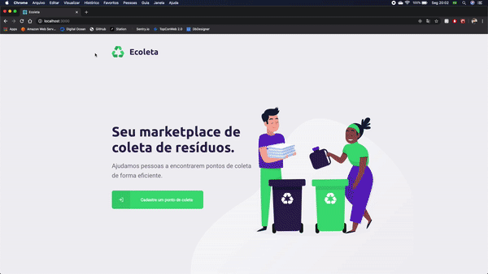

<h1 align="center">
    
</h1>

<h4 align="center"> 
	:heavy_check_mark: #NextLevelWeek 1.0 :rocket: :heavy_check_mark:
</h4>

<p align="center">

  <a href="https://github.com/fnoquiq/Ecoleta/stargazers">
    
  </a>

  <a href="https://github.com/fnoquiq/Ecoleta/issues">
    
  </a>

  <a href="https://github.com/fnoquiq/Ecoleta/pulls">
    
  </a>

  <a href="https://github.com/fnoquiq/Ecoleta/blob/master/LICENSE">
    
  </a>

</p>

### Configurar API

```bash
# Entre na pasta da API
$ cd ecoleta/server

# Instale as dependências
$ yarn install

# Rode as migrations
$ yarn knex:migrate

# Rode os seeds
$ yarn knex:seed

# Inicie a API
$ yarn dev

```

### Iniciar front-end web

```bash
# Entre na pasta web
$ cd ecoleta/web

# Instale as dependências
$ yarn install

# Inicie o servidor
$ yarn start

```

<h1 align="center">
    
</h1>

### Iniciar mobile expo

```bash
# Entre na pasta mobile
$ cd ecoleta/mobile

# Instale as dependências
$ yarn install

# Inicie o servidor
$ yarn start

# Expo irá abrir, você então deve escanear o QR Code com a câmera do celular.

```

<h1 align="center">
    
</h1>

---

## :package: Importar configurações do Insomnia

Para testar a API do Ecoleta, baixe e instale o [Insomnia](https://insomnia.rest/download/) e após a instalação, clique no botão abaixo.

[](https://insomnia.rest/run/?label=Ecoleta&uri=https%3A%2F%2Fgithub.com%2Ffnoquiq%2FEcoleta%2Fblob%2Fmaster%2F.github%2Finsomnia%2Finsomnia.json)

---

## :memo: License

Esse projeto está sob a licença MIT. Veja a [LICENÇA](https://github.com/fnoquiq/Ecoleta/blob/master/LICENSE) para mais detalhes.
